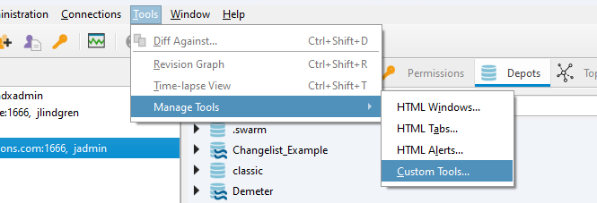

# p4_bulk_project_creator

This python gui application allows you to create multiple users, groups and depots from a csv file.
Additionally, it will populate the depots with streams and populate the streams with files based on a template depot. In order for a depot to show up on the template list, the depot must contain the word "template" in it's name.

This is an example of the csv file format:
```csv
Name,E-mail,Group_Name,Owner
Walter Reed,wreed@student.email,202230_356_Group08,True
Xenia Collins,xcollins@student.email,202230_356_Group08,
Yasmin Edwards,yedwards@student.email,202230_356_Group08,
Anna Powell,apowell@student.email,202230_356_Group09,True
Brian Hughes,bhughes@student.email,202230_356_Group09,
```

(Examples of good and bad CSV files for testing can be found in the `data/` folder.)

**Name**: The name field is used for the user's full name.

**E-mail**: Usernames in Helix Core will be the first part of the email address (before the @ symbol).

The email field must match the email domain specified in the config file. If no email domain is specified, any email address will be accepted. (see below)

**Group_Name**: The group name field is used to specify which group the user will be added to.

The group names are also the names of the depots which will be created.

The permissions will be updated so that users in each group can write to the depot of the same name.

**Owner**: If this field is set to true, the user will be set as an owner of the group, which will allow them to add and remove users from the group.
This can be set to false or left blank for other users.

## Requirements
- P4 CLI
- A Helix Core server to connect to
- Super user login to P4 server

## Installation
### Precompiled Binary
The `bin` directory contains precompiled binaries for Windows and MacOS arm64 (aka M-series processors)

1. Clone this repo to a location on your computer:
    ```
    git clone git@github.com:vertigojc/p4_bulk_project_creator.git
    ```
2. Login to P4Admin as a super user and go to **Tools > Manage Tools > Custom Tools...**
    
3. On the Custom Tools windows, select **New > Tool...**
    
4. On the Add Local Tool Window, fill in these fields:
    
    1. **Name:** Enter whatever name you would like to show up in the tools menu.
    2. **Application:** Browse to the path to the executable file for your operating system (.exe for windows, (arm64) for M-series OSX)
    3. **Start In:** The `Start In` directory is where the program will look for the `config.ini` file, and where it will output logs as `log.txt` and undo files (for easy undoing if you need to reset) as `undo_commands-[YYYY-MM-DD-HH-MM-SS].txt`.
    4. **Refresh Helix Admin:** This checkbox will make sure you see the results of your changes right away after closing the tool.
    
    
5. Click **OK** on all the windows. Now, when you go to the Tools menu at the top, you should see your new custom tool!
    

### Python Install
If you would prefer not to use the precompiled binaries or you wish to customize the code, there are a couple additional steps.

1. You will need to have Python 3.8 or higher (tested with 3.11) installed.
2. After cloning the repository, cd to the repo directory and install requirements (PyQt6 and P4Python)
    ```
    pip install -r requirements.txt
    ```
3. Verify that it runs.
    ```
    python app/main.py
    ```
4. Follow the steps above for adding a custom tool to P4Admin but **Application** and **Arguments** will be different.

    1. **Application:** Here, enter the path to your python installation.
    2. **Arguments:** For arguments, enter the path to the `app/main.py` script inside the repository.
    3. **Start In:** See above for explanation, but this is where the config and logs will be.


## Configuration
The `config.ini` file can be edited to add a custom email domain and custom initial password for created users.

By default, any standard email address will be accepted.

By default, the initial password for all users will be `ChangeMe123!`.

For example, if you wanted to only validate email addresses that end in @myuniversity.edu, and change the default password to "myUniversitySecret#45" set the `config.ini` file to:

```
[DEFAULT]
EMAIL_DOMAIN = myuniversity.edu
DEFAULT_PASSWORD = myUniversitySecret#45
```

**Users will be forced to change their password when they first login**

## Notes
- Server must be 2022.1 or higher for the undo commands to work properly when removing streams.
